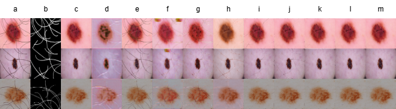

# A-Mel: Resource-efficient Deep Learning for Precise Early Melanoma Diagnosis

  

## Overview

Early and precise diagnosis of melanoma significantly improves patient prognosis. **A-Mel** is a state-of-the-art, resource-efficient deep learning agent designed specifically for early melanoma diagnosis. Our approach overcomes key challenges including occlusion by hair, varied lesion morphologies, and limited computational resources in clinical environments.

A-Mel comprises three integrated sequential modules:

- **Hair Artifact Removal Preprocessing**
- **Pathological Lesion Segmentation**
- **Melanoma Classification**

  

  <b>Fig. 2.</b> Visual comparison of different hair artifact removal methods. 
  a) Dermoscopic image with synthetic hair artifacts, b) Ground truth lesion mask, c) Original (clean) dermoscopic image, d) FastCUT, e) Swin-Unet, f) QGAN, g) PatchGAN, h) Directly U-Net, i) U-Net with inpainting, j) R-MNet, k) U²-Net, l) CBAM-enhanced U²-Net, m) A-Mel (ours).

## Key Features

- **Modified U²Net++ Architecture**: Enhanced with depthwise separable convolutions, drastically reducing model parameters and computational load.
- **Dual-Path Spatial Attention (DPSA) + Efficient Channel Attention (ECA)**: Novel attention mechanisms ensuring multi-scale and multi-dimensional feature enhancement.
- **Atrous Spatial Pyramid Pooling (ASPP)**: Robust multi-scale feature representation.
- **Vision Transformer (ViT)**: Integrated with the DPSA-ECA composite attention framework for accurate lesion classification.

## Performance

Evaluations on ISIC 2019 and ISIC 2020 datasets:

- **Accuracy**: 99.12% (State-of-the-art)
- **Extremely Lightweight**: Minimal parameters, small model size, and fast inference speed ideal for edge deployment.

